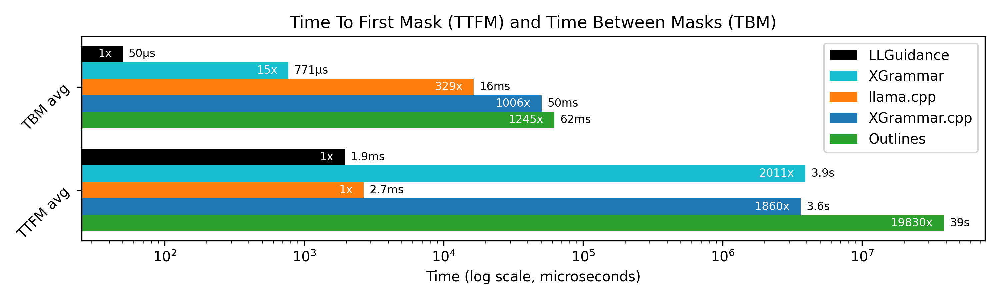
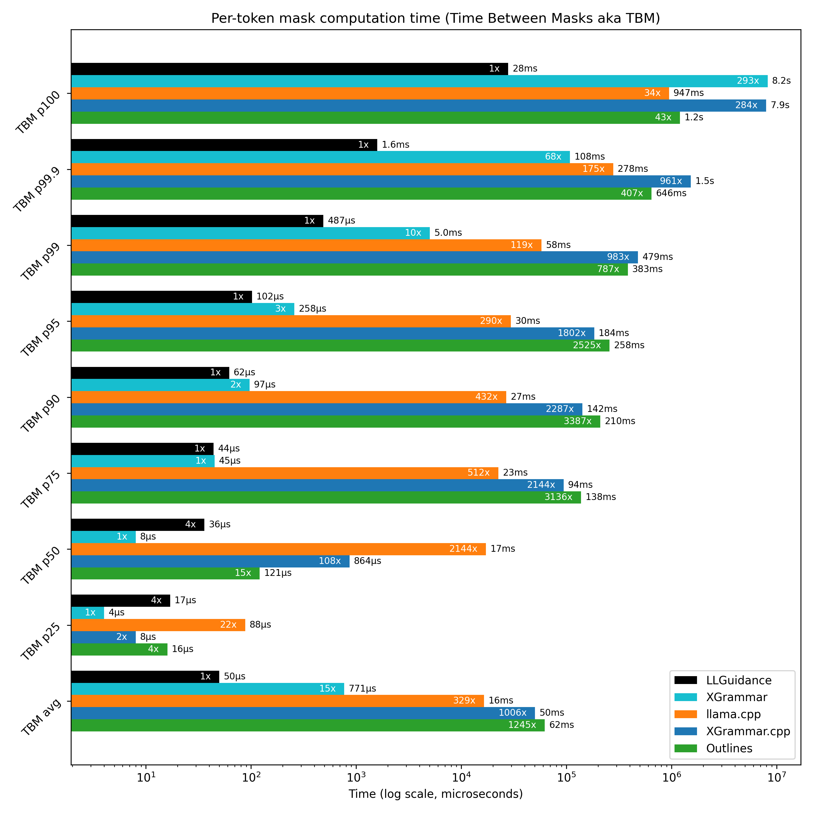
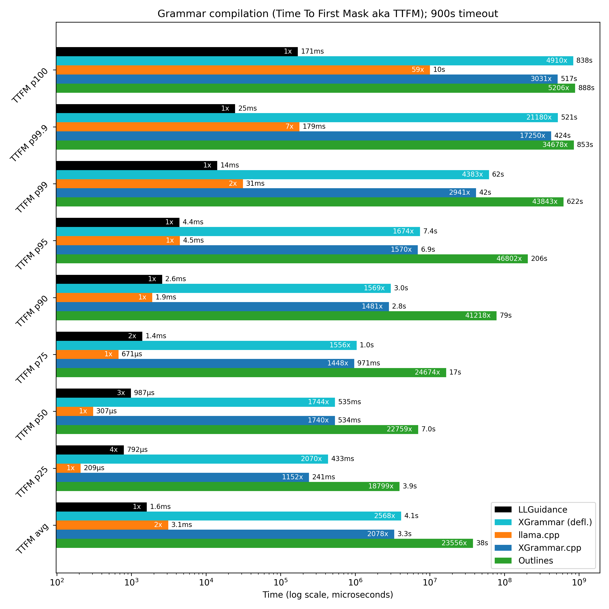

# MaskBench

    

The primary focus of the top-level repository is end-to-end performance and accuracy of JSON Schema-constrained generation.
See [paper](https://arxiv.org/abs/2501.10868) for general methodology, description of data and results.

This folder, however, contains scripts and results dedicated to benchmarking mask computation in isolation, without involving an LLM.
By isolating mask computation, this benchmark assesses its standalone performance, which is particularly relevant for server-side scenarios with large batch sizes.

### Data Overview

- **Data Folder (`data/`)**: Contains ~10k schemas, with 13k valid and 23k invalid instances (total: ~2M tokens). About 1.5k schemas lack tests.  
- **Schema Instances**: Each schema includes valid and invalid examples for benchmarking and correctness testing. See [Testcases](#testcases) for details on data generation and stats on the testcases.

## Benchmark Results

    

    

## Engines Benchmarked

1. **[LLGuidance](https://github.com/guidance-ai/llguidance)**
2. **[llama.cpp](https://github.com/ggerganov/llama.cpp)** grammars,
  with [json_schema_to_grammar.py](https://github.com/ggerganov/llama.cpp/blob/master/examples/json_schema_to_grammar.py)
  with whitespace regex modified to `/[ \t\n\r]*/` to match JSON definition
  (by default it puts limits on the amount of whitespace, which slows down the engine).
3. **[XGrammar](https://github.com/mlc-ai/xgrammar)** in default configuration.
4. **"XGrammar.cpp"**: XGrammar with the llama.cpp script above.
5. **[Outlines](https://github.com/dottxt-ai/outlines)**

## Test Environment

- **Hardware**: Azure [NC96ads_A100_v4](https://learn.microsoft.com/en-us/azure/virtual-machines/sizes/gpu-accelerated/nca100v4-series?tabs=sizebasic) with 96 threads (48 cores), 880 GiB RAM, 4x A100 GPUs (GPUs not utilized).
- **Constraints**: 
  - Time: 15 minutes per schema.
  - Memory: 40 GiB resident set size.
  - Threads: 40-thread limit.

- Engines were executed single-threaded to emulate large batch scenarios (where batch size is larger than the number of available cores).
- XGrammar was set to only use a single thread per sequence, LLGuidance and llama.cpp always do that.
- Outlines normally uses several threads per sequence, so it was run with 90 parallel threads, so it doesn't get more CPU time than the other engines.

## Key Findings

- **Grammar Compilation Time (TTFM)**:
  - **LLGuidance** and **llama.cpp** had near-instantaneous compilation.
  - **Outlines** was the slowest, with 1000+ timeouts (15+ minutes).
  - **XGrammar**'s TTFM is 3–4 orders of magnitude slower than **LLGuidance** and **llama.cpp**. It's likely grammar compilation time can be hidden in prefill time (especially when parallelized).

- **Mask Computation Time (TBM)**:
  - **XGrammar** outperforms **LLGuidance** on simple cases (p25–p75), but becomes 2x and 10x slower at p90 and p99, respectively.
  - **LLGuidance** is thus 6x faster on average due to better tail performance.
  - **Outlines** is very slow despite pre-computed results.
  - **XGrammar.cpp** lags significantly (2–3 orders of magnitude slower than **LLGuidance** from p50 onward).

## Random notes

- for TBM, with batch size 100 and forward pass time of 20ms, the p99 happens 50 times per second,
  and p99.9 happens 5 times per second; unless handled specially, these mask computations
  will hold the entire batch
- the TTFM is cut off at 900s due to timeout (especially relevant for Outlines)
- while LLGuidance has the biggest number of compile errors,
  it has almost no validation errors nor crashes;
  in other words it's upfront about what it cannot do
- the "invalidation errors" are cases where a generation should be rejected,
  but wasn't; these are clear bugs
- "validation errors" may be more tricky due to object property ordering;
  however, all engines stick to definition order in `properties`
  (except for llama.cpp, which puts required properties first),
  and engines other than LLGuidance don't support `allOf` and sibling properties
  (which introduces complications to the ordering)
- by default, XGrammar uses fixed white-space and assumes `"additionalProperties": false`;
  it also ignores keywords like `minItems` and `maxItems`, as well as `allOf`, sibling properties, etc.;
  this all significantly reduces complexity of the grammar
- OTOH, grammars used in XGrammar.cpp configuration are similar in feature coverage
  and flexibility to the ones used in LLGuidance; thus it provides a more
  apples-to-apples comparison of the grammar engines (as opposed to grammars)

## Performance Metrics

<!-- GEN-BEGIN -->
| metric             | LLGuidance |    XGrammar |  llama.cpp | XGrammar.cpp |    Outlines |
|:-------------------|-----------:|------------:|-----------:|-------------:|------------:|
| TBM avg            |         50 |         771 |     16,436 |       50,315 |      62,228 |
| TBM p25            |         17 |           4 |         88 |            8 |          16 |
| TBM p50            |         36 |           8 |     17,155 |          864 |         121 |
| TBM p75            |         44 |          45 |     22,524 |       94,337 |     137,964 |
| TBM p90            |         62 |          97 |     26,784 |      141,814 |     210,000 |
| TBM p95            |        102 |         258 |     29,589 |      183,793 |     257,535 |
| TBM p99            |        487 |       5,020 |     57,858 |      478,804 |     383,431 |
| TBM p99.9          |      1,586 |     108,250 |    278,274 |    1,524,187 |     645,958 |
| TBM p100           |     27,941 |   8,199,574 |    947,327 |    7,930,219 |   1,200,784 |
| TTFM avg           |      1,948 |   3,916,662 |      2,670 |    3,622,566 |  38,629,148 |
| TTFM p25           |        902 |     408,489 |        214 |      234,804 |   4,204,700 |
| TTFM p50           |      1,123 |     510,506 |        313 |      519,446 |   7,542,705 |
| TTFM p75           |      1,648 |   1,008,591 |        677 |      945,082 |  17,252,827 |
| TTFM p90           |      3,139 |   2,931,927 |      1,905 |    2,717,198 |  84,271,384 |
| TTFM p95           |      5,655 |   7,274,962 |      4,077 |    6,677,797 | 205,526,487 |
| TTFM p99           |     17,428 |  60,849,724 |     29,125 |   40,494,738 | 599,366,609 |
| TTFM p99.9         |     37,675 | 474,232,993 |    116,978 |  559,318,667 | 837,063,663 |
| TTFM p100          |    174,410 | 590,103,807 | 10,170,430 |  887,830,420 | 898,295,471 |
| tokens             |  2,565,248 |   2,135,421 |  2,035,114 |    1,471,038 |   1,042,964 |
| schemas            |     10,163 |      10,163 |     10,163 |       10,163 |      10,163 |
| passing            |      7,765 |       5,237 |      5,476 |        5,356 |       4,250 |
| compile error      |      2,373 |       2,019 |      1,292 |        1,709 |       3,608 |
| segmentation fault |          0 |         196 |          0 |            1 |           0 |
| out of memory      |          0 |           0 |          0 |            0 |          13 |
| timeout            |          0 |          15 |          1 |           48 |       1,024 |
| validation error   |         25 |       1,425 |      2,745 |        2,726 |         653 |
| invalidation error |          0 |       1,271 |        649 |          323 |         615 |

### Versions

* llguidance: 0.6.26
* xgrammar: 0.1.13
* llama-cpp-python: 0.3.7
* outlines: 0.1.14
<!-- GEN-END -->

## Reproducing Results

- **Run Masks**: Use `scripts/run_maskbench.py`. Example:  
  `./scripts/run_maskbench.py --xgr-compliant data/`  
  Results are saved in `tmp/out--xgr-compliant`.
  See `./scripts/run_maskbench.py --help` for more options, in particular resource limits.
  
- **Analyze Results**: Generate tables and plots with  
  `./scripts/maskbench_results.py`.

## Testcases

The schema instances were generated using the Meta Llama 3.1 70B instruct model. The output was constrained to produce valid JSON, though not strictly conforming to the schema. For valid instances, the model was further prompted to modify them into invalid ones.

Prompts for invalid instances were adjusted to emphasize specific schema features (e.g., `maxItems`, `pattern`, `minLength`, `if` etc.), while some instances were generated without such focus. The data generation scripts are located in the `creation/` folder.

Both valid and invalid instances were validated using Python and Rust jsonschema libraries.

Tests are categorized by origin and complexity. The table below summarizes the number of schemas, the percentage with generated instances, and the count of valid and invalid instances (some schemas have multiple valid/invalid instances).

For valid instances only (since invalid instances are not generated in production), the following metrics are computed:

- **Average tokens per instance** (as counted by the Llama3 tokenizer).
- **Fast-forward token share**, measured for two cases:
  1. Regular JSON (allowing whitespace wherever permitted by the spec).
  2. Compacted JSON (no whitespace anywhere).

Compacted JSON is preferred unless the model is fine-tuned on indented JSON.

Fast-forward tokens are additional tokens that can be appended to the model's context window after sampling. These tokens are 3-10x faster to compute than regular tokens. For example, a 15% share of fast-forward tokens corresponds to a 10-13% increase in throughput.

| split           | schemas | has tests | valid inst. | invalid inst. | tok/inst. |  FF | FF compact |
|:----------------|--------:|----------:|------------:|--------------:|----------:|----:|-----------:|
| Github_trivial  |     444 |       73% |         460 |           771 |        41 |  3% |         5% |
| Github_easy     |    1943 |       87% |        2641 |          4611 |        46 | 11% |        14% |
| Github_hard     |    1240 |       68% |        1493 |          3405 |       339 | 16% |        19% |
| Github_medium   |    1976 |       87% |        3091 |          6119 |       141 | 11% |        13% |
| Github_ultra    |     164 |       54% |         160 |           302 |       768 | 19% |        21% |
| Glaiveai2K      |    1707 |       61% |        1634 |          1104 |        30 | 21% |        25% |
| Kubernetes      |    1064 |       89% |        1680 |          2908 |        86 |  9% |        10% |
| Snowplow        |     403 |       95% |         670 |          1730 |       142 |  9% |        11% |
| WashingtonPost  |     125 |       78% |         146 |           330 |        95 | 12% |        14% |
| MCPspec         |      45 |       78% |          44 |            44 |        45 | 20% |        29% |
| JsonSchemaStore |     492 |       73% |         679 |          1405 |       295 |  7% |         7% |
| TOTAL           |   10163 |       75% |       12821 |         23047 |       133 | 13% |        15% |